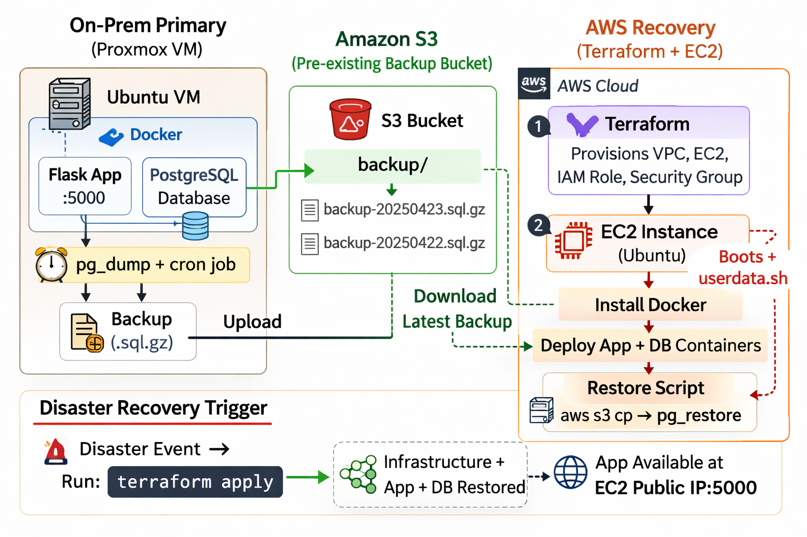

# Hybrid Cloud Disaster Recovery (On-Prem + AWS)
**WGU D342 Cloud Computing Capstone**

Engineer: Jeff Fontenot  
Track: BS Cloud Computing – AWS

---

## Overview

This project implements a practical hybrid cloud disaster recovery (DR) solution designed for small-business workloads.

The primary environment runs on-premises. Database backups are stored in Amazon S3. In a disaster scenario, Terraform provisions AWS infrastructure and automatically restores the latest database backup into a recovery EC2 instance.

The recovery process requires only:

    terraform apply

All remaining steps (infrastructure provisioning, container deployment, database restore) are automated via cloud-init and scripting.

---

## Architecture Diagram

---

## Architecture Summary

### Primary Environment (On-Prem)
- Ubuntu Server (Proxmox VM)
- Docker containers:
  - Python Flask API
  - PostgreSQL database
- Scheduled database backup
- Compressed backup uploaded to Amazon S3

### Recovery Environment (AWS)
- Terraform-provisioned VPC and EC2 instance
- IAM Instance Profile (no static credentials)
- S3 bucket for offsite backup storage
- cloud-init bootstrap
- Docker-based application stack
- Automated database restore from S3

---

## Recovery Workflow

### Normal Operation
1. Orders are written to PostgreSQL on-prem
2. Scheduled job creates compressed SQL backup
3. Backup uploaded to Amazon S3

### Disaster Recovery
1. Run `terraform apply`
2. AWS infrastructure is provisioned
3. EC2 executes `userdata.sh`
4. Docker stack deploys
5. Latest backup is downloaded from S3
6. Database is restored
7. Application becomes available with original data

---

## Validation Tests Performed

- `docker compose ps` confirms running services
- `/health` endpoint returns `{"status":"ok"}`
- `/orders` endpoint returns restored data
- Database row count verified via SQL query

---

## Security Considerations

- EC2 uses IAM role (no embedded AWS keys)
- Least-privilege S3 access
- Data encrypted in transit (HTTPS)
- Terraform state excluded from version control

---

## Recovery Objectives

- Recovery Point Objective (RPO): 1 hour (defined by backup frequency)
- Recovery Time Objective (RTO): < 5 minutes (validated via Terraform-based recovery test)

---

## Known Limitations / Future Enhancements

- No automated DNS failover
- No monitoring or alerting system
- No SSL termination for public production use
- Schema restore could be made more idempotent

---

## Purpose

This capstone demonstrates:

- Infrastructure as Code (Terraform)
- Cloud-native disaster recovery design
- Automated recovery validation
- Secure IAM-based cloud access
- Cost-conscious hybrid architecture

This project reflects a realistic approach to selective cloud adoption for resilience without requiring full-time cloud operation.
