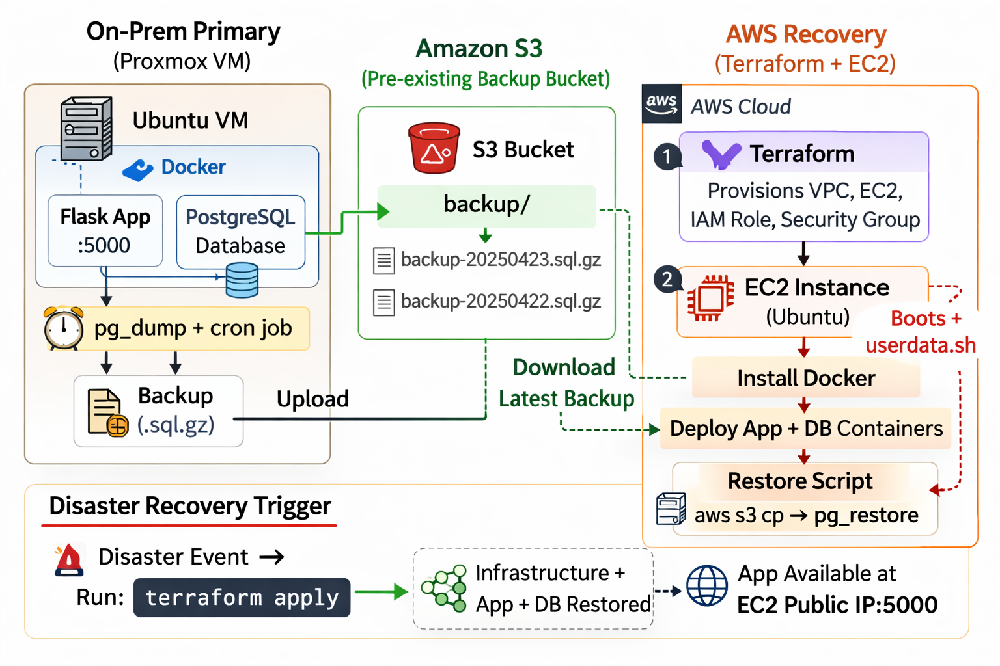

# Hybrid Cloud Disaster Recovery (On-Prem + AWS)
**WGU D342 Cloud Computing Capstone**

Engineer: Jeff Fontenot  
Track: BS Cloud Computing – AWS

---

## Overview

This project implements a practical hybrid-cloud disaster-recovery solution for a containerized small-business application.

The primary Flask and PostgreSQL environment runs on an Ubuntu Server VM hosted in Proxmox. Hourly database backups are compressed and uploaded to Amazon S3. During a simulated disaster, recovery is initiated with a single operator command:

    terraform apply

Terraform then provisions the AWS recovery infrastructure. EC2 user data installs the required software, launches the application stack with Docker Compose, retrieves the latest PostgreSQL backup from S3, and restores the database without additional operator intervention.

---

## Architecture Diagram

---

## Architecture Summary

### Primary Environment (On-Prem)
- Ubuntu Server (Proxmox VM)
- Docker containers:
  - Python Flask API
  - PostgreSQL database
- Scheduled database backup
- Compressed backup uploaded to Amazon S3

### Recovery Environment (AWS)
- Terraform-provisioned VPC and EC2 instance
- IAM Instance Profile (no static credentials)
- S3 bucket for offsite backup storage
- cloud-init bootstrap
- Docker-based application stack
- Automated database restore from S3

---

## Recovery Workflow

### Normal Operation
1. Orders are written to PostgreSQL on-prem
2. Scheduled job creates compressed SQL backup
3. Backup uploaded to Amazon S3

### Disaster Recovery
1. Run `terraform apply`
2. AWS infrastructure is provisioned
3. EC2 executes `userdata.sh`
4. Docker stack deploys
5. Latest backup is downloaded from S3
6. Database is restored
7. Application becomes available with original data

---

## Validation Tests Performed

- `docker compose ps` confirms running services
- `/health` endpoint returns `{"status":"ok"}`
- `/orders` endpoint returns restored data
- Database row count verified via SQL query

---

## Security Considerations

- EC2 accesses Amazon S3 through an IAM instance profile; no static AWS credentials are embedded in the recovery instance.
- The IAM policy limits the instance to the S3 permissions required for backup retrieval.
- AWS API and S3 transfers are protected with TLS.
- Terraform state and local variable files are excluded from version control.
- The restored application endpoint does not currently include production-grade TLS termination and should not be exposed publicly without an HTTPS-capable reverse proxy or load balancer.

---

## Recovery Objectives

- Recovery Point Objective (RPO): Approximately 1 hour, determined by the scheduled backup frequency.
- Recovery Time Objective (RTO): 3 minutes 55 seconds, measured during a complete Terraform-based recovery test.

---

## Known Limitations / Future Enhancements

- No automated DNS failover
- No monitoring or alerting system
- No SSL termination for public production use
- Schema restore could be made more idempotent

---

## Purpose

This capstone demonstrates:

- Infrastructure as Code (Terraform)
- Cloud-native disaster recovery design
- Automated recovery validation
- Secure IAM-based cloud access
- Cost-conscious hybrid architecture

This project reflects a realistic approach to selective cloud adoption for resilience without requiring full-time cloud operation.
